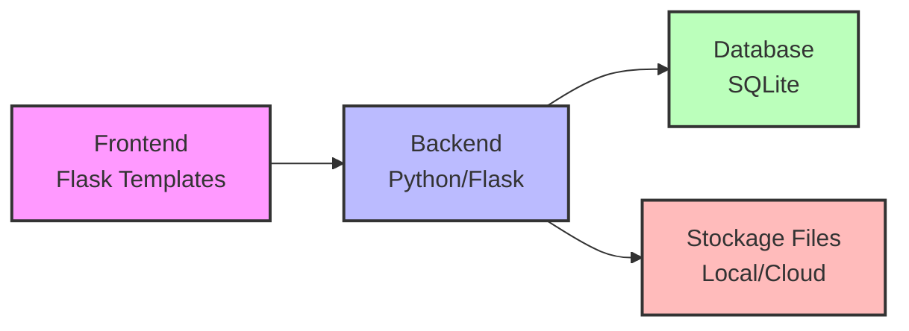
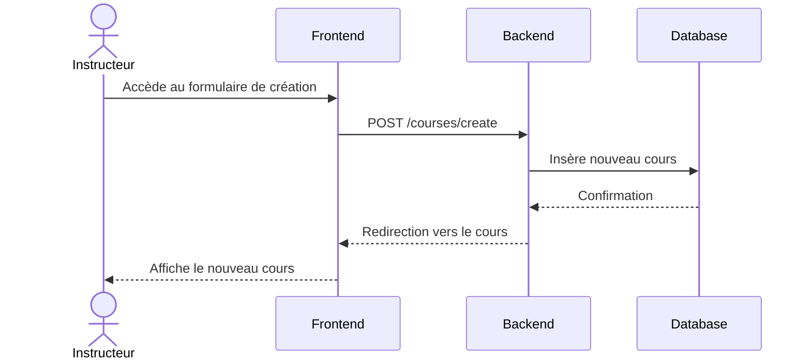
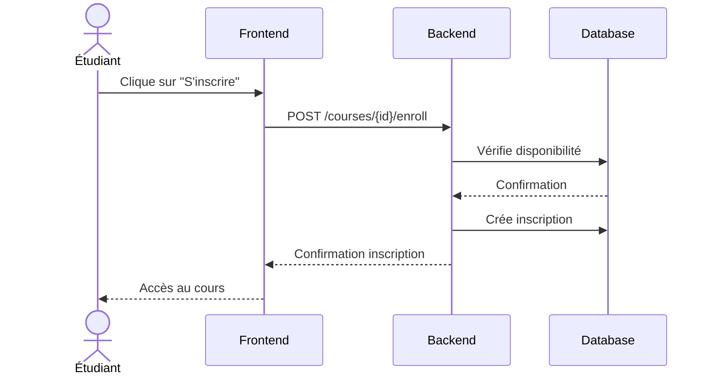

# Documentation Technique HolbyDoc - Stage 3

## Table des Matières
1. [Histoires Utilisateurs et Maquettes](#1-histoires-utilisateurs-et-maquettes)
2. [Architecture du Système](#2-architecture-du-système)
3. [Composants, Classes et Design de la Base de Données](#3-composants-classes-et-design-de-la-base-de-données)
4. [Diagrammes de Séquence](#4-diagrammes-de-séquence)
5. [Spécifications des API](#5-spécifications-des-api)
6. [Stratégies SCM et QA](#6-stratégies-scm-et-qa)
7. [Justifications Techniques](#7-justifications-techniques)

## 1. Histoires Utilisateurs et Maquettes

### Histoires Utilisateurs Prioritaires (MoSCoW)

#### Must Have
- En tant qu'étudiant, je veux pouvoir m'inscrire à la plateforme afin d'accéder aux cours.
- En tant qu'étudiant, je veux pouvoir parcourir le catalogue des cours afin de choisir ceux qui m'intéressent.
- En tant qu'instructeur, je veux pouvoir créer et publier des cours afin de partager mon expertise.
- En tant qu'utilisateur, je veux pouvoir me connecter de manière sécurisée à mon compte.

#### Should Have
- En tant qu'étudiant, je veux pouvoir suivre ma progression dans les cours afin de mesurer mon avancement.
- En tant qu'instructeur, je veux pouvoir modifier mes cours existants afin de les maintenir à jour.
- En tant qu'étudiant, je veux pouvoir laisser des commentaires sur les cours afin de partager mon feedback.

#### Could Have
- En tant qu'étudiant, je veux pouvoir télécharger le contenu des cours pour un apprentissage hors ligne.
- En tant qu'instructeur, je veux pouvoir voir des statistiques sur mes cours afin d'évaluer leur impact.

#### Won't Have (pour la MVP)
- Système de messagerie instantanée entre utilisateurs
- Support multilingue complet

## 2. Architecture du Système

### Architecture Globale


### Composants Principaux
- **Frontend** : Templates Flask avec Jinja2
- **Backend** : Application Flask en Python
- **Base de données** : SQLite pour la MVP
- **Stockage de fichiers** : Système de fichiers local

## 3. Composants, Classes et Design de la Base de Données

### Classes Principales

```python
class User:
    - id: Integer (PK)
    - username: String
    - email: String
    - password_hash: String
    - role: String
    - created_at: DateTime

class Course:
    - id: Integer (PK)
    - title: String
    - description: Text
    - author_id: Integer (FK)
    - created_at: DateTime
    - updated_at: DateTime
    - thumbnail: String

class Lesson:
    - id: Integer (PK)
    - course_id: Integer (FK)
    - title: String
    - content: Text
    - order: Integer
```

### Schéma de la Base de Données
```sql
CREATE TABLE users (
    id INTEGER PRIMARY KEY,
    username TEXT UNIQUE NOT NULL,
    email TEXT UNIQUE NOT NULL,
    password_hash TEXT NOT NULL,
    role TEXT NOT NULL,
    created_at DATETIME DEFAULT CURRENT_TIMESTAMP
);

CREATE TABLE courses (
    id INTEGER PRIMARY KEY,
    title TEXT NOT NULL,
    description TEXT,
    author_id INTEGER,
    created_at DATETIME DEFAULT CURRENT_TIMESTAMP,
    updated_at DATETIME,
    thumbnail TEXT,
    FOREIGN KEY (author_id) REFERENCES users (id)
);

CREATE TABLE lessons (
    id INTEGER PRIMARY KEY,
    course_id INTEGER,
    title TEXT NOT NULL,
    content TEXT,
    order_num INTEGER,
    FOREIGN KEY (course_id) REFERENCES courses (id)
);
```

## 4. Diagrammes de Séquence

### Création d'un Cours


### Inscription à un Cours


## 5. Spécifications des API

### Points d'Entrée API

#### Gestion des Utilisateurs
```
POST /api/users/register
- Input: { username, email, password }
- Output: { user_id, token }

POST /api/users/login
- Input: { email, password }
- Output: { token }
```

#### Gestion des Cours
```
GET /api/courses
- Output: [{ id, title, description, author }]

POST /api/courses
- Input: { title, description, content }
- Output: { course_id }

GET /api/courses/{id}
- Output: { course_details }
```

## 6. Stratégies SCM et QA

### Gestion du Code Source (SCM)
- **Outil**: Git
- **Repository**: GitHub
- **Stratégie de Branches**:
  - `main`: Production
  - `develop`: Développement principal
  - `feature/*`: Nouvelles fonctionnalités
  - `bugfix/*`: Corrections de bugs
  - `release/*`: Préparation des releases

### Assurance Qualité (QA)
- **Tests Unitaires**: pytest
- **Tests d'Intégration**: pytest avec fixtures Flask
- **Couverture de Code**: Minimum 80%
- **Linting**: flake8, pylint
- **Revue de Code**: Obligatoire avant merge

## 7. Justifications Techniques

### Choix Technologiques

#### Python/Flask
- Facilité d'apprentissage et de maintenance
- Large écosystème de bibliothèques
- Performance adéquate pour la MVP
- Excellent support pour le développement web

#### SQLite
- Installation zéro configuration
- Parfait pour la MVP et le prototypage
- Migration facile vers PostgreSQL si nécessaire
- Intégration native avec Python

#### Système de Templates Flask
- Intégration native avec Flask
- Rendu côté serveur pour meilleure SEO
- Développement rapide de l'interface utilisateur