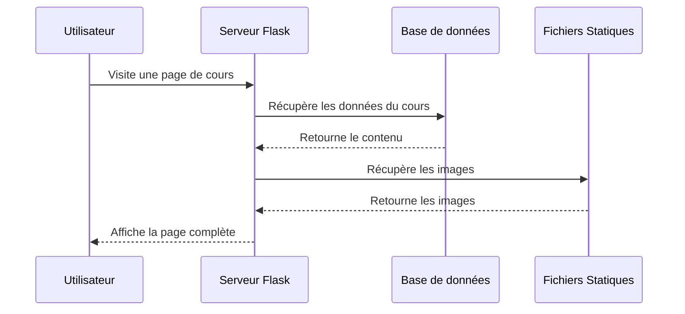
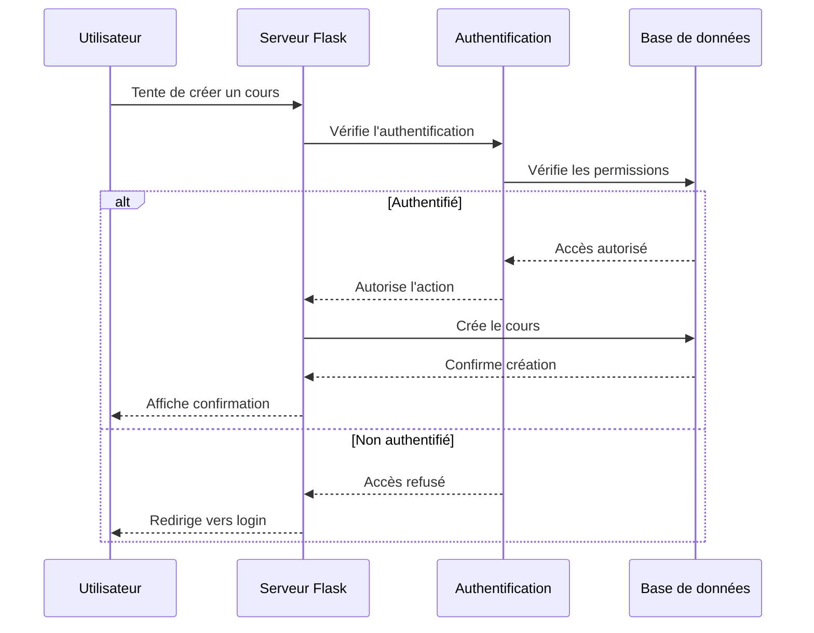

# Explication du Flux de Données dans HolbyDoc

## Vue d'ensemble
Notre application HolbyDoc suit deux chemins principaux de flux de données :
1. Accès Public (consultation)
2. Actions Protégées (création/édition)

## 1. Accès Public (consultation des cours/leçons)

### Étapes du flux

### Exemple concret
Quand un visiteur accède à un cours :
1. L'utilisateur visite `/courses/python-basics`
2. Le serveur demande les données du cours à SQLite
3. Le serveur récupère les images associées
4. La page est construite et envoyée au navigateur

## 2. Actions Protégées (création/édition)

### Étapes du flux

### Exemple concret
Quand un utilisateur crée un cours :
1. POST vers `/courses/new` avec les données
2. Vérification de la session utilisateur
3. Si authentifié :
   - Sauvegarde des données
   - Upload des images
   - Redirection vers le nouveau cours
4. Si non authentifié :
   - Redirection vers la page de login

## Points clés du système

### Sécurité
- Authentification avec Flask-Login
- Sessions sécurisées
- Protection CSRF sur les formulaires
- Validation des données côté serveur

### Performance
- Accès public sans authentification
- Chargement optimisé des images
- Requêtes SQL efficaces via SQLAlchemy

### Interface Utilisateur
- Feedback immédiat des actions
- Messages d'erreur clairs
- Navigation intuitive

## Avantages de cette architecture

1. **Séparation des accès**
   - Contenu public accessible à tous
   - Actions sensibles protégées
   - Permissions basées sur les rôles

2. **Modularité**
   - Composants indépendants
   - Facilement extensible
   - Maintenance simplifiée

3. **Expérience utilisateur**
   - Chargement rapide
   - Interface responsive
   - Feedback clair des actions