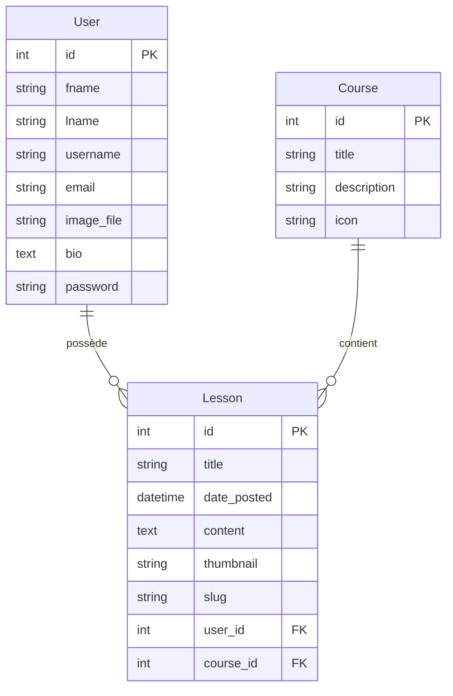

# Diagramme de la base de données HolbyDoc

**Légende :**
- `PK` = Primary Key (clé primaire)
- `FK` = Foreign Key (clé étrangère)
- Les relations montrent qu'un utilisateur peut avoir plusieurs leçons, et un cours peut contenir plusieurs leçons.
