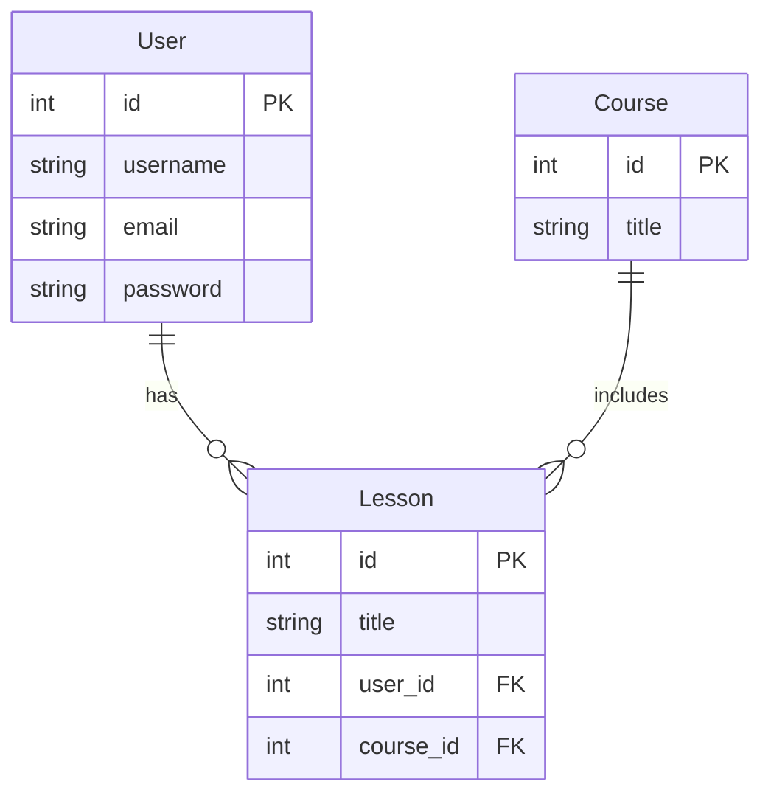

# HolbyDoc Database Diagram

```mermaid
erDiagram
    User ||--o{ Lesson : has
    Course ||--o{ Lesson : includes

    User {
        int id PK
        string username
        string email
        string password
    }

    Lesson {
        int id PK
        string title
        int user_id FK
        int course_id FK
    }

    Course {
        int id PK
        string title
    }
```

**Legend:**
- `PK` = Primary Key
- `FK` = Foreign Key
- A user can have many lessons; a course can include many lessons.
