# HolbyDoc - Architecture et Flux de Données

## 1. Architecture Globale


## 2. Flux de Données Global

```mermaid
sequenceDiagram
    participant Client as Navigateur
    participant Server as Flask Server
    participant Auth as Authentication
    participant DB as Database
    participant Static as Static Files

    Note over Client,Static: Flux principal de l'application
    
    Client->>Server: 1. Requête HTTP
    
    alt Accès public (cours/leçons)
        Server->>DB: 2a. Requête données publiques
        DB-->>Server: 3a. Retourne contenu
        Server->>Static: 4a. Récupère images associées
        Static-->>Server: 5a. Retourne images
        Server-->>Client: 6a. Affiche contenu avec images
    else Action protégée (création/édition)
        Server->>Auth: 2b. Vérifie session utilisateur
        Auth->>DB: 3b. Vérifie permissions
        
        alt Utilisateur authentifié
            DB-->>Auth: 4b. Accès autorisé
            Server->>DB: 5b. Exécute l'action
            alt Upload d'images
                Server->>Static: 6b. Sauvegarde images
            end
            DB-->>Server: 7b. Confirme action
            Server-->>Client: 8b. Retourne résultat
        else Non authentifié
            Auth-->>Server: 4c. Accès refusé
            Server-->>Client: 5c. Redirige vers login
        end
    end
```


## 3. Technologies Utilisées

### Frontend
- **HTML5/CSS3**
  - Structure sémantique
  - Design responsive
  - Classes CSS personnalisées

- **Jinja2 Templates**
  - Moteur de template pour Flask
  - Fonctionnalités principales utilisées :
    ```html
    {# Héritage de templates #}
    
    

    {# Variables et expressions #}
    {{ title }}
    {{ url_for('static', filename='image.jpg') }}

    {# Conditions #}
    
        <a href="{{ url_for('profile') }}">Profile</a>
    

    {# Boucles #}
    
        <div class="card">{{ course.title }}</div>
    
    ```

- **Bootstrap 5**
  - Grille responsive
  - Composants UI
  - Classes utilitaires
  - JavaScript de base (navigation mobile)

### Backend Framework
- **Flask**: Framework web principal
  - Routing système
  - Gestion des requêtes
  - Intégration native avec Jinja2

### Base de données
- **SQLite**: Stockage des données
  - Simple à configurer
  - Pas de serveur séparé nécessaire
  - Idéal pour MVP
- **SQLAlchemy**: ORM
  - Mapping objet-relationnel
  - Gestion des relations
  - Requêtes optimisées

### Authentification
- **Flask-Login**: Gestion des sessions
  - Décorateurs d'authentification (@login_required)
  - Gestion des sessions utilisateur
  - Protection des routes d'administration

### Gestion des formulaires
- **WTForms**: Validation des données
  - Validation côté serveur
  - Protection CSRF
  - Messages d'erreur personnalisés

### Édition de contenu
- **CKEditor**: Éditeur WYSIWYG
  - Support markdown
  - Upload d'images
  - Plugins personnalisables

### Gestion des Fichiers Statiques
- **Dossiers statiques**:
  - course_icons/ : Images des cours
  - lesson_thumbnails/ : Miniatures des leçons
  - user_pics/ : Photos de profil
  - media/ : Images des contenus (CKEditor)