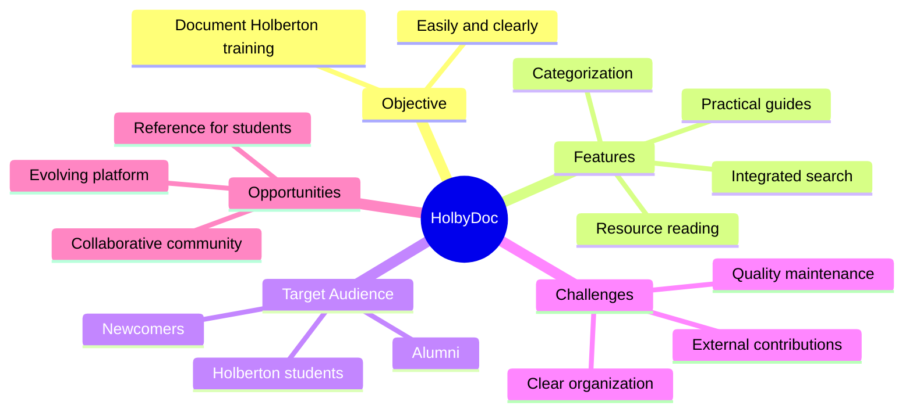

# Stage 1 Report - Portfolio Project (Stage 1)

## 1. Team Formation Overview

**Members:**  
Ibrahim Houmaidi

**Roles:**  
- **Lead Developer:** Ibrahim Houmaidi  
- **Project Manager:** Ibrahim Houmaidi  
- **Communication Manager:** Ibrahim Houmaidi

**Collaboration Strategy:**

**Tools Used:**  
- **Google Calendar:** time and task organization  
- **Slack:** quick internal communication  
- **Github:** centralization of code and documents

**Established Communication Standards:**  
- Response within 24 hours for Slack exchanges  
- Weekly updates of documents on Github

---

## 2. Selected MVP Concept

**Project Name:** HolbyDoc

**Project Summary:**  
HolbyDoc is an online documentation platform centralizing resources, explanations, summaries, and practical guides related to Holberton School training. It aims to simplify the understanding of projects and technical concepts while promoting collaboration among students.

**Problem Solved:**  
Holberton School students often encounter difficulties finding clear explanations or organized resources. Documents are frequently scattered or lack proper context.  
HolbyDoc centralizes and structures essential resources, facilitating autonomous and collaborative learning.

**Reasons for Selection:**  
- Direct utility: addresses a real need for Holberton School students  
- Technical feasibility: implementation possible with HTML/CSS/JS, Flask or Django, Markdown, SQLAlchemy database  
- Strong connection to the current training program  
- Scalability: possibility to add advanced search, community contributions, tagging, etc.  
- Potential impact: reusable tool for other cohorts and campuses

**Potential Challenges:**  
- Logical content structuring (hierarchy, navigation, filters)  
- Maintaining content quality and consistency  
- Implementing a controlled contribution system  

**Opportunities:**  
- Reference tool for all Holberton students  
- Medium-term community development  
- Deployment as public documentation or internal resource (intranet)

**Target Audience:**  
- Holberton students (all levels)  
- Newcomers seeking guidance in the program  
- Alumni wanting to quickly find key resources

---

## 3. Idea Development Documentation

**Process Followed:**  
- Personal brainstorming around needs experienced as a Holberton student  
- Identification of recurring problems (time wasted searching for resources, lack of clarity, redundancies)  
- Evaluation of ideas according to:  
  - Technical feasibility  
  - Community impact  
  - Originality in approach (customized platform)  
- Selection of HolbyDoc for its direct utility, viability, and capacity to evolve

**Documentation Used:**  
- **Google Calendar:** weekly planning  
- **Discord:** exchanges, surveys with other students  
- **Google Drive:** documentation drafts, section organization

---

## 4. Project Mind Map

---

## 5. Working Folder URL

**[PORTFOLIO PROJECT](https://github.com/Braganov/HolbyDoc.git)**
