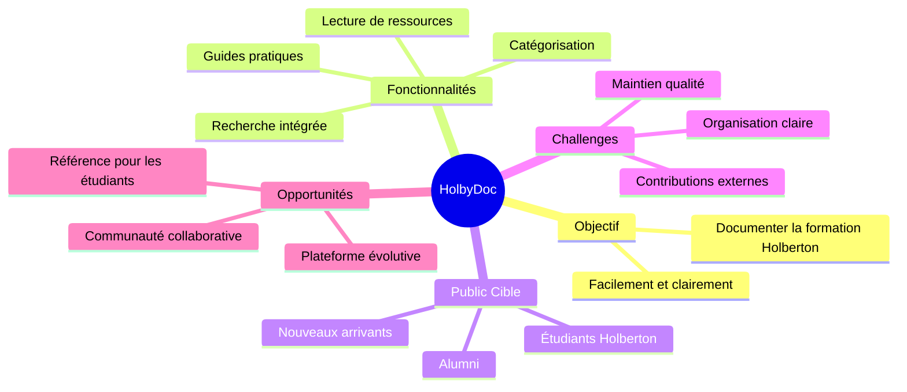

# Stage 1 Report - Portfolio Project (Stage 1)

## 1. Team Formation Overview

**Membres :**  
Ibrahim Houmaidi

**Rôles :**  
- **Développeur principal :** Ibrahim Houmaidi  
- **Chef de projet :** Ibrahim Houmaidi  
- **Responsable communication :** Ibrahim Houmaidi

**Stratégie de collaboration :**

**Outils utilisés :**  
- **Google Agenda :** organisation du temps et des tâches  
- **Slack :** communication interne rapide  
- **Github :** centralisation du code et des documents

**Normes de communication établies :**  
- Réponse sous 24h en cas d'échanges via Slack  
- Mise à jour hebdomadaire des documents sur Github

---

## 2. Selected MVP Concept

**Nom du projet :** HolbyDoc

**Résumé du projet :**  
HolbyDoc est une plateforme de documentation en ligne centralisant les ressources, explications, résumés et guides pratiques relatifs à la formation Holberton School. Elle vise à simplifier la compréhension des projets, des concepts techniques et à favoriser l’entraide entre étudiants.

**Le problème résolu :**  
Les étudiants de la Holberton School peuvent rencontrer des difficultés à retrouver des explications claires ou des ressources organisées. Les documents sont souvent dispersés ou peu contextualisés.  
HolbyDoc centralise et structure les ressources essentielles, facilitant ainsi l'apprentissage autonome et collaboratif.

**Raisons de la sélection :**  
- Utilité directe : répond à un besoin réel des étudiants de la Holberton School  
- Faisabilité technique : implémentation possible avec HTML/CSS/JS, Flask ou Django, Markdown, base SQLAlchemy  
- Lien fort avec la formation suivie  
- Scalabilité : possibilité d'ajouter recherche avancée, contributions communautaires, tagging, etc.  
- Impact potentiel : outil réutilisable par d'autres cohortes et campus

**Challenges potentiels :**  
- Structuration logique des contenus (arborescence, navigation, filtres)  
- Maintien de la qualité et de la cohérence des contenus  
- Implémentation d’un système de contribution contrôlé  

**Opportunités :**  
- Outil de référence pour tous les étudiants Holberton  
- Développement communautaire à moyen terme  
- Déploiement comme documentation publique ou interne (intranet)

**Public cible :**  
- Étudiants Holberton (tous niveaux)  
- Nouveaux arrivants souhaitant s’orienter dans le programme  
- Alumni voulant retrouver des ressources clés rapidement

---

## 3. Idea Development Documentation

**Processus suivi :**  
- Brainstorming personnel autour de besoins vécus en tant qu’étudiant Holberton  
- Identification de problèmes récurrents (perte de temps à chercher les ressources, manque de clarté, redondances)  
- Évaluation des idées selon :  
  - Faisabilité technique  
  - Impact sur la communauté  
  - Originalité dans l'approche (plateforme personnalisée)  
- Sélection de HolbyDoc pour son utilité directe, sa viabilité et sa capacité à évoluer

**Documentation utilisée :**  
- **Google Agenda :** planification hebdomadaire  
- **Discord :** échanges, sondages auprès d’autres étudiants  
- **Google Drive :** drafts de la documentation, organisation des sections

---

## 4. Carte mentale du projet

---

## 5. URL du dossier de travail

**[PORTFOLIO PROJECT](https://github.com/Braganov/HolbyDoc.git)**
