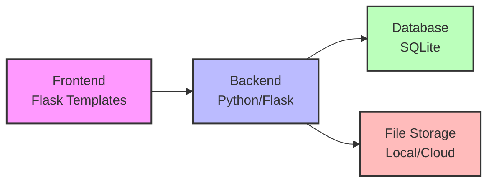
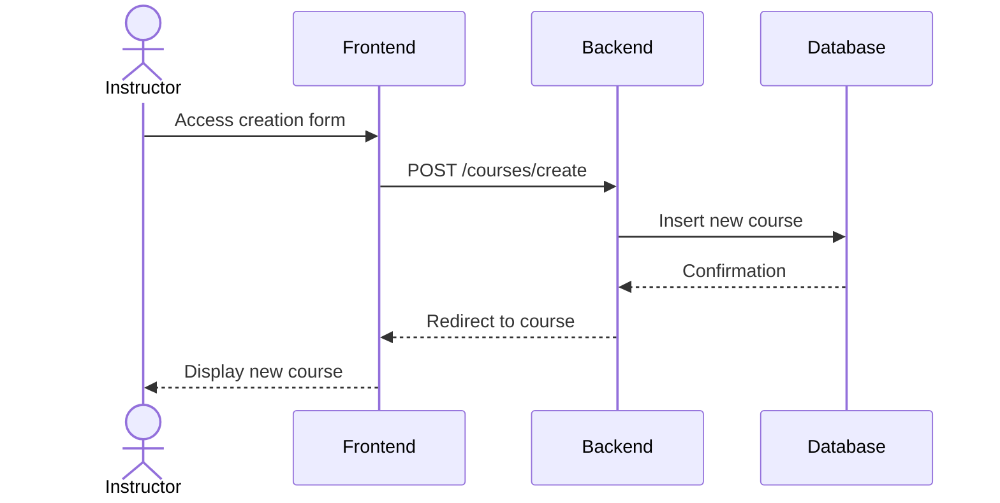
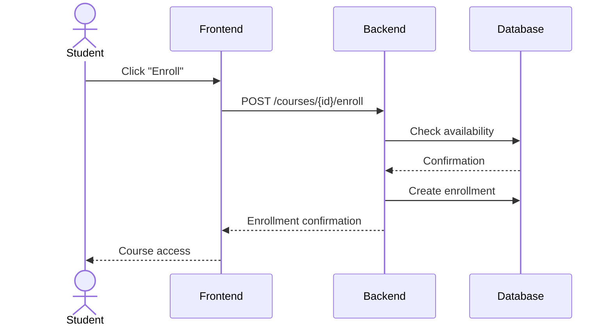

# HolbyDoc Technical Documentation - Stage 3

## Table of Contents
1. [User Stories and Mockups](#1-user-stories-and-mockups)
2. [System Architecture](#2-system-architecture)
3. [Components, Classes and Database Design](#3-components-classes-and-database-design)
4. [Sequence Diagrams](#4-sequence-diagrams)
5. [API Specifications](#5-api-specifications)
6. [SCM and QA Strategies](#6-scm-and-qa-strategies)
7. [Technical Justifications](#7-technical-justifications)

## 1. User Stories and Mockups

### Priority User Stories (MoSCoW)

#### Must Have
- As a student, I want to register on the platform to access courses.
- As a student, I want to browse the course catalog to choose courses that interest me.
- As an instructor, I want to create and publish courses to share my expertise.
- As a user, I want to securely log into my account.

#### Should Have
- As a student, I want to track my progress in courses to measure my advancement.
- As an instructor, I want to modify my existing courses to keep them up to date.
- As a student, I want to leave comments on courses to share my feedback.

#### Could Have
- As a student, I want to download course content for offline learning.
- As an instructor, I want to view statistics about my courses to evaluate their impact.

#### Won't Have (for MVP)
- Instant messaging system between users
- Payment integration for premium courses
- Complete multilingual support

## 2. System Architecture

### Global Architecture


### Main Components
- **Frontend**: Flask Templates with Jinja2
- **Backend**: Flask Application in Python
- **Database**: SQLite for MVP
- **File Storage**: Local file system

## 3. Components, Classes and Database Design

### Main Classes

```python
class User:
    - id: Integer (PK)
    - username: String
    - email: String
    - password_hash: String
    - role: String
    - created_at: DateTime

class Course:
    - id: Integer (PK)
    - title: String
    - description: Text
    - author_id: Integer (FK)
    - created_at: DateTime
    - updated_at: DateTime
    - thumbnail: String

class Lesson:
    - id: Integer (PK)
    - course_id: Integer (FK)
    - title: String
    - content: Text
    - order: Integer
```

### Database Schema
```sql
CREATE TABLE users (
    id INTEGER PRIMARY KEY,
    username TEXT UNIQUE NOT NULL,
    email TEXT UNIQUE NOT NULL,
    password_hash TEXT NOT NULL,
    role TEXT NOT NULL,
    created_at DATETIME DEFAULT CURRENT_TIMESTAMP
);

CREATE TABLE courses (
    id INTEGER PRIMARY KEY,
    title TEXT NOT NULL,
    description TEXT,
    author_id INTEGER,
    created_at DATETIME DEFAULT CURRENT_TIMESTAMP,
    updated_at DATETIME,
    thumbnail TEXT,
    FOREIGN KEY (author_id) REFERENCES users (id)
);

CREATE TABLE lessons (
    id INTEGER PRIMARY KEY,
    course_id INTEGER,
    title TEXT NOT NULL,
    content TEXT,
    order_num INTEGER,
    FOREIGN KEY (course_id) REFERENCES courses (id)
);
```

## 4. Sequence Diagrams

### Course Creation


### Course Enrollment


## 5. API Specifications

### API Endpoints

#### User Management
```
POST /api/users/register
- Input: { username, email, password }
- Output: { user_id, token }

POST /api/users/login
- Input: { email, password }
- Output: { token }
```

#### Course Management
```
GET /api/courses
- Output: [{ id, title, description, author }]

POST /api/courses
- Input: { title, description, content }
- Output: { course_id }

GET /api/courses/{id}
- Output: { course_details }
```

## 6. SCM and QA Strategies

### Source Code Management (SCM)
- **Tool**: Git
- **Repository**: GitHub
- **Branch Strategy**:
  - `main`: Production
  - `develop`: Main development
  - `feature/*`: New features
  - `bugfix/*`: Bug fixes
  - `release/*`: Release preparation

### Quality Assurance (QA)
- **Unit Tests**: pytest
- **Integration Tests**: pytest with Flask fixtures
- **Code Coverage**: Minimum 80%
- **Linting**: flake8, pylint
- **Code Review**: Mandatory before merge

## 7. Technical Justifications

### Technology Choices

#### Python/Flask
- Easy to learn and maintain
- Large ecosystem of libraries
- Adequate performance for MVP
- Excellent web development support

#### SQLite
- Zero configuration installation
- Perfect for MVP and prototyping
- Easy migration to PostgreSQL if needed
- Native Python integration

#### Flask Template System
- Native Flask integration
- Server-side rendering for better SEO
- Rapid UI development